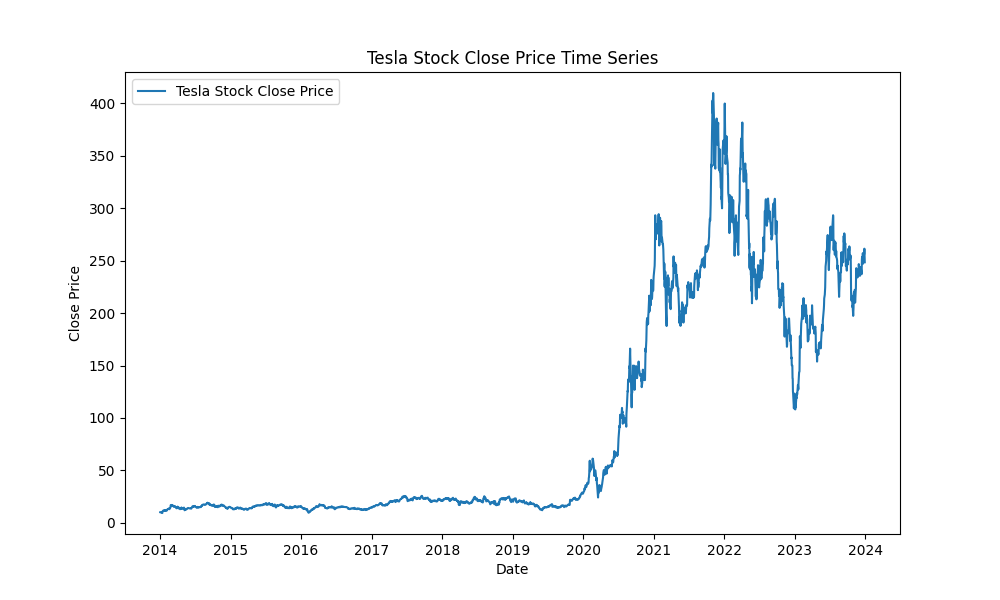
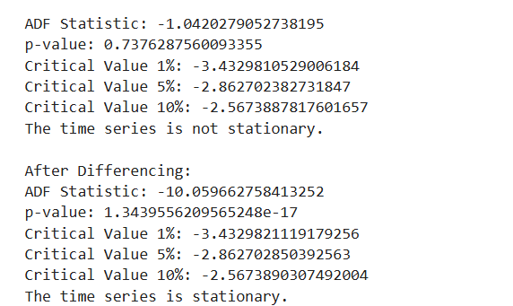
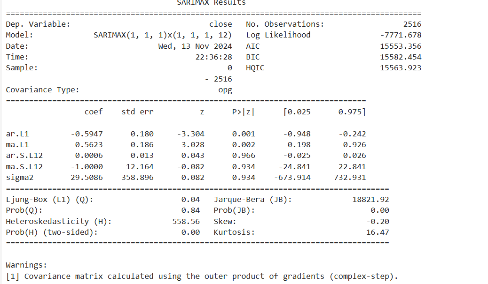
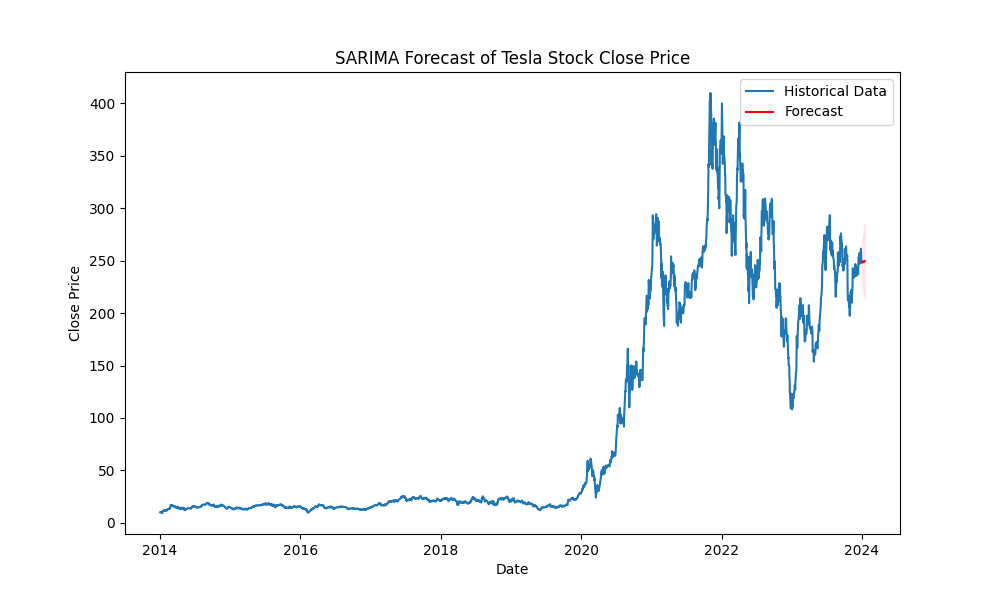
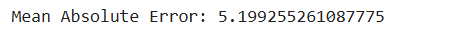

# Exp.no: 10   IMPLEMENTATION OF SARIMA MODEL


### AIM:
To implement SARIMA model using python.
### ALGORITHM:
1. Explore the dataset
2. Check for stationarity of time series
3. Determine SARIMA models parameters p, q
4. Fit the SARIMA model
5. Make time series predictions and Auto-fit the SARIMA model
6. Evaluate model predictions
### PROGRAM:
```python 
import pandas as pd
import numpy as np
from statsmodels.tsa.statespace.sarimax import SARIMAX
from statsmodels.tsa.stattools import adfuller
import matplotlib.pyplot as plt
from sklearn.metrics import mean_absolute_error
import warnings

warnings.filterwarnings("ignore")

# Load the Tesla stock data
file_path = 'tsla_2014_2023.csv'
data = pd.read_csv(file_path)
data['date'] = pd.to_datetime(data['date'])
data.set_index('date', inplace=True)
time_series = data['close']

# Plot the Close price time series
plt.figure(figsize=(10, 6))
plt.plot(time_series, label="Tesla Stock Close Price")
plt.title('Tesla Stock Close Price Time Series')
plt.xlabel('Date')
plt.ylabel('Close Price')
plt.legend()
plt.savefig('tesla_close_price_series.png')
plt.show()

# Function to test stationarity
def test_stationarity(timeseries):
    result = adfuller(timeseries)
    print('ADF Statistic:', result[0])
    print('p-value:', result[1])
    for key, value in result[4].items():
        print(f'Critical Value {key}: {value}')
    if result[1] < 0.05:
        print("The time series is stationary.")
    else:
        print("The time series is not stationary.")

# Test stationarity of the original time series
test_stationarity(time_series)

# Differencing if non-stationary
time_series_diff = time_series.diff().dropna()
print("\nAfter Differencing:")
test_stationarity(time_series_diff)

# SARIMA model parameters
p, d, q = 1, 1, 1
P, D, Q, m = 1, 1, 1, 12  # m=12 assumes monthly seasonality

# Fit the SARIMA model
model = SARIMAX(time_series, order=(p, d, q), seasonal_order=(P, D, Q, m), enforce_stationarity=False, enforce_invertibility=False)
sarima_fit = model.fit(disp=False)
print(sarima_fit.summary())

# Forecasting
forecast_steps = 12  # Forecast 12 future periods
forecast = sarima_fit.get_forecast(steps=forecast_steps)
forecast_ci = forecast.conf_int()

# Generate date index for forecast
forecast_index = pd.date_range(start=time_series.index[-1] + pd.Timedelta(days=1), periods=forecast_steps, freq='B')

# Plot historical data and forecast, saving the plot as an image
plt.figure(figsize=(10, 6))
plt.plot(time_series, label='Historical Data')
plt.plot(forecast_index, forecast.predicted_mean, label='Forecast', color='red')
plt.fill_between(forecast_index, forecast_ci.iloc[:, 0], forecast_ci.iloc[:, 1], color='pink', alpha=0.3)
plt.title('SARIMA Forecast of Tesla Stock Close Price')
plt.xlabel('Date')
plt.ylabel('Close Price')
plt.legend()
plt.savefig('tesla_sarima_forecast.png')
plt.show()

# Calculate Mean Absolute Error (MAE) on the forecast (if comparing with existing data)
test_data = time_series[-forecast_steps:]
pred_data = forecast.predicted_mean[:len(test_data)]
mae = mean_absolute_error(test_data, pred_data)
print('Mean Absolute Error:', mae)

```

### OUTPUT:







### RESULT:
Thus the program run successfully based on the SARIMA model.
